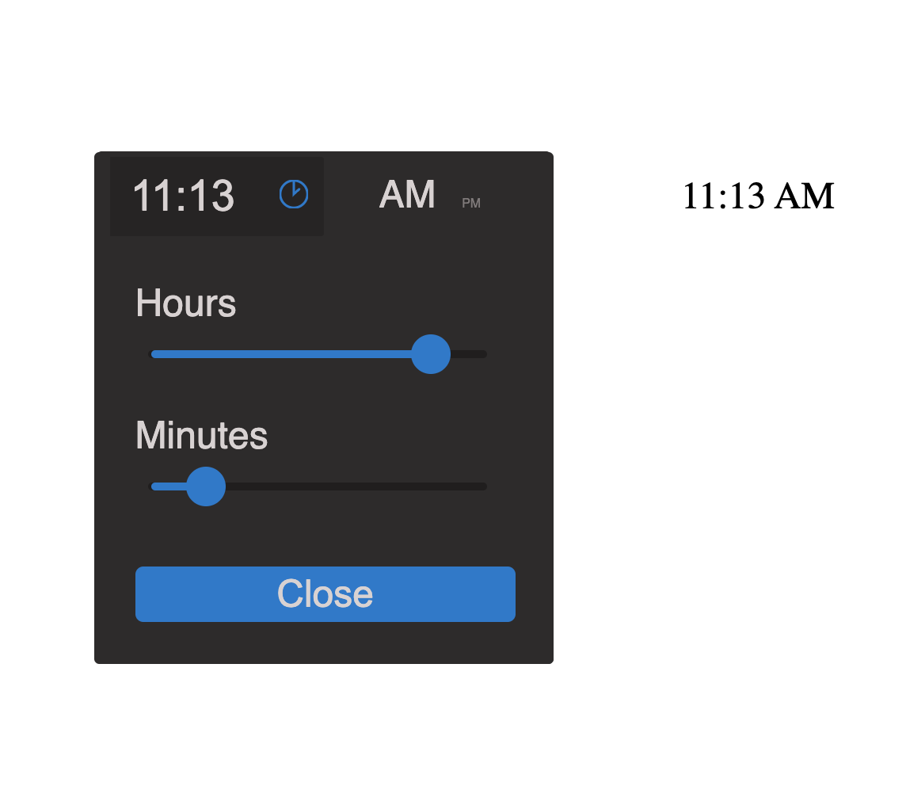

### React Slider Time Picker
 
 1 dependency - styled-components 
 
### Installation

```sh
npm install slider-time-picker
import "slider-time-picker/dist/sliderTimePicker.css";
```

### DEMO

[code   demo](https://stackblitz.com/edit/react-ts-ckrgva?file=App.tsx)


 


```JSX
import TimePicker from "slider-time-picker";
import "slider-time-picker/dist/sliderTimePicker.css";

...

  <TimePicker
      time={time}
      onChange={onTimeChange}
      disabled={false}
  ></TimePicker>
  
  <label>Disabled</label>
  <TimePicker
     time={time}
     onChange={onTimeChange}
     disabled={true}
   ></TimePicker>
   
   <p>Manual input disabled</p>
   <TimePicker
     time={time}
     onChange={onTimeChange}
     disableTimeManualEntry={true}
   ></TimePicker>
 ```
** If you would like to change the styling you can use the following css as an example to alter the style for the TimePicker **


```JSX
.time .time-input::after {
  content: "🕒";
  line-height: 1;
}
.time .time-input input {
  background: white;
  border: solid white;
}
.time {
  background: white;
  box-shadow: none;
}
.toggle label {
  background: white;
}
.toggle label span.on {
  color: black;
}
.toggle label span.off {
  color: rgb(187, 95, 95);
}
.time-picker .modal-content {
  background: white;
}
.edit-form .accept-time button {
  background: rgb(187, 95, 95);
  border: solid rgb(187, 95, 95);
  color: white;
}
.time-picker .slider-track {
  background: rgb(187, 95, 95);
  border: solid 2px #333;
}

.time-picker .slider > div:before {
  background: rgb(187, 95, 95);
}

.time-picker .slider > div:after {
  background: rgb(187, 95, 95);
  border: solid rgb(187, 95, 95);
}
.time-picker label {
  color: black;
}
.time-picker .time .time-input input {
  color: black;
}

```
