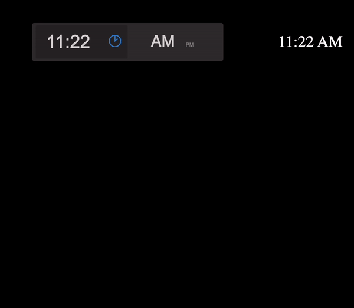

### React Slider Time Picker

1 dependency - styled-components

### Installation

```sh
npm install slider-time-picker
import "slider-time-picker/dist/sliderTimePicker.css";
```

### DEMO

[code demo](https://stackblitz.com/edit/react-ts-ckrgva?file=App.tsx)




### Props

| Prop          | Type      | Description                  |
| ------------- | --------- | ---------------------------- |
| time          | string    | 07:00 AM                     |
| disabled      | boolean   | disables all actions         |
| allowTextEdit | boolean   | allows time edit manually    |
| ref           | React ref | allows access to the picker  |
| colors        | object    | set colors for the component |

```JSX
import TimePicker from "slider-time-picker";
import "slider-time-picker/dist/sliderTimePicker.css";

const colors = {
  "primary-color": "black",
  "primary-font-color": "pink",
  "background-color": "#1e2528",
  "slider-track-color": "red"
};

...

  <TimePicker
      time={time}
      onChange={onTimeChange}
      disabled={false}
  ></TimePicker>

  <label>Disabled</label>
  <TimePicker
     time={time}
     onChange={onTimeChange}
     disabled={true}
   ></TimePicker>

   <p>Manual input disabled</p>
   <TimePicker
     time={time}
     onChange={onTimeChange}
     allowTextEdit={true}
   ></TimePicker>


```
